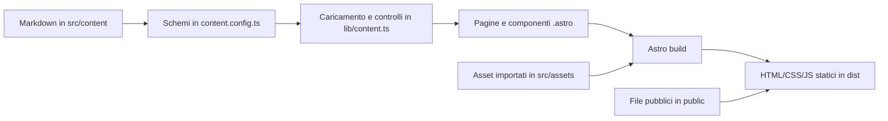

# Guida tecnica alla codebase di Fabrizio's Webhome

**Progetto analizzato:** `fabrizioswebhome`  
**Data dell'analisi:** 13 agosto 2026  
**Tecnologie principali:** Astro 7, TypeScript, HTML, CSS, Markdown/YAML, JavaScript nel browser, Node.js

Questa guida spiega il codice così com'è oggi. Non è una guida generica costruita su esempi astratti: quasi tutti gli esempi provengono direttamente dai file del sito. Quando viene segnalata una differenza fra documentazione e implementazione, si descrive il comportamento effettivo del codice.

## Indice

1. [Il progetto in una frase](#1-il-progetto-in-una-frase)
2. [La distinzione più importante: build e browser](#2-la-distinzione-più-importante-build-e-browser)
3. [Mappa dei file](#3-mappa-dei-file)
4. [Come è fatto un file Astro](#4-come-è-fatto-un-file-astro)
5. [Componenti, proprietà e composizione](#5-componenti-proprietà-e-composizione)
6. [Template Astro: espressioni, condizioni e liste](#6-template-astro-espressioni-condizioni-e-liste)
7. [Routing e generazione delle pagine](#7-routing-e-generazione-delle-pagine)
8. [Content Collections, Markdown e validazione Zod](#8-content-collections-markdown-e-validazione-zod)
9. [TypeScript: sintassi e costrutti usati](#9-typescript-sintassi-e-costrutti-usati)
10. [La logica centrale di `content.ts`](#10-la-logica-centrale-di-contentts)
11. [JavaScript e TypeScript eseguiti nel browser](#11-javascript-e-typescript-eseguiti-nel-browser)
12. [HTML semantico e accessibilità](#12-html-semantico-e-accessibilità)
13. [CSS: cascata, selettori e organizzazione](#13-css-cascata-selettori-e-organizzazione)
14. [CSS: layout, dimensioni e responsive design](#14-css-layout-dimensioni-e-responsive-design)
15. [CSS: animazioni, immagini e tipografia](#15-css-animazioni-immagini-e-tipografia)
16. [URL e gestione degli asset](#16-url-e-gestione-degli-asset)
17. [Configurazione, dipendenze e comandi](#17-configurazione-dipendenze-e-comandi)
18. [Lettura file per file](#18-lettura-file-per-file)
19. [Esempi pratici di modifica](#19-esempi-pratici-di-modifica)
20. [Stato tecnico rilevato](#20-stato-tecnico-rilevato)
21. [Glossario](#21-glossario)

## 1. Il progetto in una frase

Il sito è un **generatore statico di pagine**: durante la build Astro legge configurazione, componenti e file Markdown, li valida, calcola relazioni e URL, quindi produce normali file HTML, CSS, JavaScript e asset nella cartella `dist/`.

Il flusso principale è questo:



Astro svolge quindi due ruoli:

- è il linguaggio con cui sono costruiti layout, componenti e pagine;
- è il programma che, al momento della build, trasforma tutto in un sito statico.

Il browser del visitatore non riceve `content.ts`, Zod o i sorgenti Markdown. Riceve soltanto il risultato già elaborato, più gli script interattivi necessari per Atlas, navigazione e animazioni.

## 2. La distinzione più importante: build e browser

Un file `.astro` può contenere codice eseguito in momenti diversi. Capire questa separazione evita gran parte della confusione iniziale.

| Parte del file | Dove viene eseguita | Scopo |
|---|---|---|
| frontmatter fra `---` | Node.js, durante sviluppo/build | caricare dati, fare calcoli, preparare proprietà |
| template HTML/Astro | trasformato durante la build | produrre l'HTML finale |
| `<style>` | elaborato da Astro/Vite | produrre CSS, normalmente con scope locale |
| `<script>` | browser | interazioni, DOM, animazioni |
| `<script is:inline>` | browser, senza elaborazione/bundling | eseguire subito codice letterale |

Esempio da `src/pages/index.astro`:

```astro
---
const data = await getSiteData();
const logEntries = getLogItems(data);
---

<ol class="home-log-list">
  {logEntries.map((item) => <LogItem item={item} />)}
</ol>
```

`getSiteData()` e `getLogItems()` lavorano durante la generazione della pagina. Il browser non scarica queste funzioni: riceve l'elenco `<ol>` già popolato.

Al contrario, il filtro di `src/pages/atlas/index.astro` è dentro `<script>`:

```ts
button.addEventListener("click", () =>
  applyTag(button.dataset.tag ?? ""),
);
```

Questo codice deve essere eseguito nel browser perché reagisce a un clic successivo al caricamento.

Una regola pratica:

- se il codice usa `getCollection`, file locali o dati editoriali, appartiene quasi certamente alla build;
- se usa `document`, `window`, eventi, `sessionStorage` o animazioni, appartiene al browser.

## 3. Mappa dei file

La struttura significativa è:

```text
fabrizioswebhome/
├── astro.config.mjs
├── package.json
├── package-lock.json
├── tsconfig.json
├── scripts/
│   └── validate-build.mjs
├── public/
│   ├── files/crosswords/*.pdf
│   └── images/crosswords/*.webp
├── sources/
│   ├── crosswords/
│   ├── experiments/
│   └── thoughts/
└── src/
    ├── content.config.ts
    ├── env.d.ts
    ├── assets/
    ├── components/
    ├── content/
    ├── data/site.ts
    ├── layouts/SiteLayout.astro
    ├── lib/
    │   ├── content.ts
    │   └── urls.ts
    ├── pages/
    └── styles/global.css
```

### 3.1 Responsabilità delle cartelle

| Percorso | Responsabilità |
|---|---|
| `src/pages/` | definisce le route pubbliche mediante la posizione dei file |
| `src/layouts/` | contiene lo scheletro HTML comune a tutte le pagine |
| `src/components/` | contiene parti riutilizzabili dell'interfaccia |
| `src/content/` | contiene record editoriali Markdown letti dalle Content Collections |
| `src/content.config.ts` | definisce gli schemi e le collezioni ammesse |
| `src/lib/content.ts` | carica, ordina, collega e valida i record |
| `src/lib/urls.ts` | costruisce route e URL compatibili con un eventuale base path |
| `src/data/site.ts` | configurazione generale, testi del sito, footer e navigazione |
| `src/styles/global.css` | regole globali, token grafici, layout e responsive design |
| `src/assets/` | immagini/font importati e gestiti dalla pipeline di Astro/Vite |
| `public/` | file copiati quasi letteralmente nella build e serviti con URL pubblici |
| `sources/` | sorgenti editoriali originali, non necessariamente pubblici |
| `scripts/` | controlli Node.js eseguiti dopo la build |
| `docs/` | specifiche editoriali e documentazione |

### 3.2 Moduli effettivamente importati

Il progetto usa pochi moduli esterni:

- `astro/config`: configurazione di Astro;
- `astro:content`: Content Collections, tipi dei record e rendering Markdown;
- `astro/loaders`: caricamento dei file tramite `glob()`;
- `astro/zod`: costruzione degli schemi dei contenuti;
- `astro:transitions`: navigazione client-side con `ClientRouter`;
- `node:fs`, `node:path`, `node:url`: accesso a file e percorsi durante build/validazione.

Le stringhe con prefisso `node:` indicano moduli standard di Node.js, non pacchetti installati da npm. Le stringhe con prefisso `astro:` sono moduli virtuali forniti da Astro.

## 4. Come è fatto un file Astro

### 4.1 Frontmatter e template

Un componente Astro ha normalmente questa forma:

```astro
---
// TypeScript eseguito durante la build
interface Props {
  title: string;
}

const { title } = Astro.props;
---

<!-- markup prodotto dal componente -->
<h1>{title}</h1>
```

Le due righe `---` delimitano il **frontmatter**. Qui si possono usare import, tipi, funzioni, `await` e calcoli normali TypeScript.

La seconda parte assomiglia a HTML, ma permette espressioni JavaScript/TypeScript fra parentesi graffe.

### 4.2 `Astro.props`

`Astro.props` contiene i valori passati dal componente genitore. In `PageHeader.astro`:

```ts
interface Props {
  title: string;
  room: string;
  introduction?: string;
  eyebrow?: string;
}

const { title, room, introduction, eyebrow } = Astro.props;
```

L'interfaccia dichiara il contratto del componente:

- `title` e `room` sono obbligatori;
- `introduction?` ed `eyebrow?` sono facoltativi per via di `?`;
- tutti i valori devono essere stringhe quando presenti.

Uso concreto:

```astro
<PageHeader
  title="Projects"
  room="Garden"
  introduction="Projects gather work that develops over time."
/>
```

Se mancasse `room`, TypeScript dovrebbe segnalare l'errore durante `astro check`.

### 4.3 Destructuring

Questa sintassi:

```ts
const { title, room } = Astro.props;
```

è **destructuring di oggetto**. Equivale concettualmente a:

```ts
const title = Astro.props.title;
const room = Astro.props.room;
```

Può anche assegnare valori predefiniti, come in `SiteLayout.astro`:

```ts
const {
  title,
  description = siteConfig.description,
  lang = "en",
  contentClass = "",
} = Astro.props;
```

Il valore a destra di `=` viene usato soltanto quando la proprietà ricevuta è `undefined`.

### 4.4 Interpolazione e attributi dinamici

Le parentesi graffe inseriscono un valore nel markup:

```astro
<title>{fullTitle}</title>
<meta name="description" content={description} />
<body data-section={currentSection}>
```

Nel primo caso il valore diventa testo; negli altri diventa il valore di un attributo HTML.

Astro esegue escaping del testo per sicurezza. Una stringa contenente `<script>` non viene interpretata automaticamente come HTML.

### 4.5 Attributi facoltativi

In `NavButton.astro`:

```astro
aria-current={active ? "page" : undefined}
```

Se `active` è vero, l'HTML contiene `aria-current="page"`. Se il risultato è `undefined`, Astro omette l'attributo. Questo è utile per attributi che devono esistere soltanto in certe condizioni.

### 4.6 `class:list`

`SiteLayout.astro` usa una direttiva specifica di Astro:

```astro
<main id="main-content" class:list={["site-main", contentClass]}>
```

`class:list` combina più valori in un unico attributo `class`, ignorando i valori vuoti o falsi. Nella home `contentClass="home-main"`, quindi il risultato è equivalente a:

```html
<main class="site-main home-main">
```

### 4.7 `<slot />`

Nel layout:

```astro
<main id="main-content" class:list={["site-main", contentClass]}>
  <slot />
</main>
```

`<slot />` indica dove inserire i figli passati al componente. Questa pagina:

```astro
<SiteLayout title="Projects" currentSection="projects">
  <PageHeader ... />
  <section>...</section>
</SiteLayout>
```

viene composta sostituendo lo slot con `PageHeader` e `section`. È l'equivalente Astro del concetto di “contenuto interno” di un layout.

### 4.8 Import di componenti e asset

Un componente locale viene importato come modulo:

```ts
import SiteHeader from "../components/SiteHeader.astro";
```

e poi usato con un tag che inizia per maiuscola:

```astro
<SiteHeader currentSection={currentSection} />
```

Le immagini in `src/assets` vengono anch'esse importate:

```ts
import crowSprite from "../assets/navigation/crow/Crow.png";
```

L'import non è una semplice stringa: Astro restituisce metadati dell'asset. Il codice usa `crowSprite.src`, cioè l'URL finale generato dalla pipeline.

Lo SVG del wordmark è importato e usato direttamente come componente:

```ts
import HeaderWordmark from "../assets/header/HandWrittenHeaderFabriziosWebhome.svg";
```

```astro
<HeaderWordmark
  class="webhome-header__wordmark"
  aria-hidden="true"
  focusable="false"
/>
```

Questo permette di applicare CSS ai `path` interni dello SVG.

## 5. Componenti, proprietà e composizione

I componenti separano responsabilità. Per esempio `ArtifactCard.astro` non sa come caricare l'intera collezione: riceve un singolo artifact già pronto.

```ts
interface Props {
  artifact: ArtifactEntry;
}

const { artifact } = Astro.props;
const {
  title,
  slug,
  previewAsset,
  artifactKind,
  language,
} = artifact.data;
```

Il genitore itera sui record:

```astro
{data.publicArtifacts.map((artifact) => (
  <ArtifactCard artifact={artifact} />
))}
```

Questa composizione crea una direzione chiara dei dati:

```text
pagina indice
  └── carica SiteData
      └── passa un ArtifactEntry
          └── ArtifactCard produce una card
```

### 5.1 Componenti presenti

| Componente | Ruolo |
|---|---|
| `SiteLayout.astro` | documento HTML, metadati, header, main, footer, ClientRouter |
| `SiteHeader.astro` | banner, wordmark, navigazione e comportamento responsive |
| `NavButton.astro` | singolo tasto a maiolica e animazione dello sfondo |
| `NavigationCrow.astro` | sprite e animazione del corvo fra sezioni |
| `SiteFooter.astro` | gruppi di link e segnaposto per link mancanti |
| `PageHeader.astro` | intestazione riutilizzabile delle sezioni |
| `ArtifactCard.astro` | anteprima e metadati di un artifact |
| `ProjectContents.astro` | elenco di contenuti associati a un progetto |
| `LogItem.astro` | rendering di una voce singola o batch del Log |
| `EmptyState.astro` | stato vuoto con titolo e testo |

### 5.2 Componenti presentazionali e componenti con comportamento

`EmptyState` e `PageHeader` sono quasi puramente presentazionali: ricevono dati e producono markup.

`SiteHeader`, `NavButton` e `NavigationCrow` contengono invece:

- markup;
- CSS locale;
- script eseguiti nel browser;
- gestione del ciclo di vita con gli eventi di Astro.

Questa distinzione è utile quando si modifica il progetto: una variazione di testo riguarda spesso solo props/markup; una variazione dell'animazione può coinvolgere contemporaneamente TypeScript browser e CSS.

## 6. Template Astro: espressioni, condizioni e liste

La sintassi dentro `{ ... }` è molto simile a JSX, ma il risultato viene trasformato da Astro in HTML statico.

### 6.1 Condizione con `&&`

In `PageHeader.astro`:

```astro
{eyebrow && <p class="eyebrow">{eyebrow}</p>}
```

L'operatore `&&` restituisce il secondo valore soltanto se il primo è truthy. Quindi il paragrafo viene creato solo se `eyebrow` esiste e non è una stringa vuota.

Altro esempio:

```astro
{artifact.data.summary && (
  <p class="about-copy">{artifact.data.summary}</p>
)}
```

Le parentesi tonde servono soltanto a rendere leggibile un blocco su più righe.

### 6.2 Condizione ternaria

`ProjectContents.astro` usa un ternario annidato:

```astro
{
  entries.length > 0 ? (
    <ul>...</ul>
  ) : showEmpty ? (
    <p class="muted">No public contents yet.</p>
  ) : null
}
```

La forma generale è:

```ts
condizione ? valoreSeVero : valoreSeFalso
```

Qui:

1. se esistono elementi, viene mostrata la lista;
2. altrimenti, se `showEmpty` è vero, viene mostrato il messaggio;
3. altrimenti viene restituito `null`, quindi non viene prodotto markup.

### 6.3 Iterazione con `map()`

In `SiteHeader.astro`:

```astro
{navigation.map((item) => (
  <NavButton
    label={item.shortLabel}
    href={withBase(item.href)}
    section={item.section}
    active={item.section === currentSection}
  />
))}
```

`map()` trasforma ogni oggetto dell'array `navigation` in un componente `NavButton`. Il risultato è un array di nodi renderizzabili.

### 6.4 Callback con blocco e `return`

La pagina Projects usa una callback più lunga:

```astro
{expanded.map((project) => {
  const contents = getProjectContents(data, project.data.id);

  return (
    <article class="project-row">
      ...
    </article>
  );
})}
```

Quando una arrow function usa `{ ... }` come corpo, serve un `return` esplicito. Quando usa direttamente `( ... )`, il risultato è implicito.

### 6.5 Testo misto ed espressioni

Astro permette di combinare testo ed espressioni:

```astro
<p class="meta">
  {project.data.status} · {project.data.stage}
</p>
```

Oppure di costruire la stringa completamente in TypeScript:

```astro
{` · ${entry.data.language.toUpperCase()}`}
```

Qui i backtick delimitano un **template literal** e `${...}` inserisce un valore nella stringa.

## 7. Routing e generazione delle pagine

### 7.1 Routing basato sui file

Astro deriva gli URL dalla struttura di `src/pages`:

| File | URL prodotto |
|---|---|
| `src/pages/index.astro` | `/` |
| `src/pages/projects/index.astro` | `/projects/` |
| `src/pages/atlas/index.astro` | `/atlas/` |
| `src/pages/about/academic-work/index.astro` | `/about/academic-work/` |
| `src/pages/404.astro` | pagina 404 |

Un file chiamato `index.astro` rappresenta la radice della cartella che lo contiene.

La configurazione contiene:

```js
trailingSlash: "always",
build: {
  format: "directory",
},
```

Perciò gli URL canonici terminano con `/` e la build usa cartelle con `index.html`, per esempio:

```text
dist/projects/games-and-riddles/index.html
```

### 7.2 Segmenti dinamici `[slug]`

Il nome fra parentesi quadre dichiara un parametro dinamico:

```text
src/pages/projects/[slug].astro
```

Da solo, però, `[slug]` non dice ad Astro quali pagine creare in una build statica. Serve `getStaticPaths()`:

```ts
export async function getStaticPaths() {
  const data = await getSiteData();

  return data.publicProjects.map((project) => ({
    params: { slug: project.data.slug },
    props: { project },
  }));
}
```

Ogni elemento restituito descrive una pagina:

- `params.slug` riempie il segmento `[slug]` dell'URL;
- `props.project` passa il record alla pagina.

Più sotto la pagina dichiara e legge queste props:

```ts
interface Props {
  project: CollectionEntry<"projects">;
}

const { project } = Astro.props;
```

Questo schema è ripetuto per Projects, Field Notes, Experiments e Finished Things.

### 7.3 I draft non generano route

Le route dinamiche usano array già filtrati:

```ts
data.publicExperiments.map(...)
```

`publicExperiments` contiene soltanto record con `draft: false`. Di conseguenza la filastrocca draft non entra in `getStaticPaths()` e nessun file HTML viene generato per il suo slug.

Questa è una protezione strutturale, non semplicemente visiva: il contenuto non viene soltanto nascosto dall'indice, ma non ha proprio una pagina pubblica.

### 7.4 Rendering del corpo Markdown

Un `CollectionEntry` contiene metadati in `entry.data` e il corpo Markdown separatamente. Per trasformare il corpo in un componente Astro:

```ts
import { render } from "astro:content";

const { Content } = await render(entry);
```

Poi nel template:

```astro
<div class="article-body">
  <Content />
</div>
```

Per il progetto Games & Riddles, ad esempio, il testo dopo il secondo `---` del file Markdown viene convertito in paragrafi HTML e inserito nel punto in cui compare `<Content />`.

### 7.5 `ClientRouter` e navigazione client-side

`SiteLayout.astro` importa:

```ts
import { ClientRouter } from "astro:transitions";
```

e lo inserisce nel `<head>`:

```astro
<ClientRouter fallback="swap" />
```

Il sito rimane composto da pagine statiche, ma i clic interni possono essere gestiti dal router di Astro, che sostituisce il documento senza un caricamento tradizionale completo. Per questo gli script ascoltano eventi specifici:

- `astro:before-swap`: prima che il vecchio contenuto venga sostituito; usato per cleanup;
- `astro:page-load`: dopo il caricamento iniziale e dopo ogni navigazione gestita da Astro; usato per reinizializzare le interazioni.

L'attributo:

```astro
<html transition:animate="none">
```

partecipa al sistema di transizioni, specificando che il nodo non deve avere un'animazione visiva di transizione.

## 8. Content Collections, Markdown e validazione Zod

Le Content Collections trasformano file editoriali in record tipizzati e validati.

### 8.1 Dichiarazione delle collezioni

In `src/content.config.ts`:

```ts
const projects = defineCollection({
  loader: glob({
    pattern: "**/*.md",
    base: "./src/content/projects",
  }),
  schema: commonFields.extend({
    title: z.string().min(1),
    slug,
    status: projectStatus,
    // ...
  }),
});
```

I pezzi sono:

- `defineCollection(...)`: registra una collezione Astro;
- `glob(...)`: trova i file che corrispondono a un pattern;
- `**/*.md`: qualunque file Markdown, anche in sottocartelle;
- `base`: cartella dalla quale partire;
- `schema`: regole applicate ai dati del frontmatter.

Alla fine tutte le collezioni vengono esportate con nomi stabili:

```ts
export const collections = {
  projects,
  fieldNotes,
  experiments,
  artifacts,
  logEntries,
};
```

Questi nomi vengono poi usati in chiamate come `getCollection("projects")` e nel tipo `CollectionEntry<"projects">`.

### 8.2 Anatomia di un record Markdown

Esempio ridotto da `src/content/artifacts/cruciverba-1.md`:

```md
---
id: cruciverba-1
title: Cruciverba 1
slug: cruciverba-1
stage: complete
draft: false
language: it
artifactKind: crossword
primaryAsset: /files/crosswords/cruciverba-1.pdf
projects:
  - id: games-and-riddles
    highlight: true
    order: 1
creationDate:
  precision: day
  value: "2024-05-18"
addedToSite: "2026-08-13"
---

An Italian-language crossword by Fabrizio Caragiulo.
```

La parte iniziale è **YAML frontmatter**:

- `chiave: valore` definisce una proprietà;
- l'indentazione crea oggetti annidati;
- `-` crea un elemento di array;
- `true` e `false` sono booleani;
- le virgolette mantengono esplicitamente un valore come stringa.

Il testo dopo il secondo `---` è il corpo Markdown.

### 8.3 Costruttori Zod usati

Zod costruisce gli schemi concatenando metodi.

#### Stringa con regola

```ts
const stableId = z
  .string()
  .regex(/^[a-z0-9]+(?:-[a-z0-9]+)*$/);
```

- `z.string()` richiede una stringa;
- `.regex(...)` richiede che rispetti un'espressione regolare;
- la regex ammette identificatori kebab-case come `games-and-riddles`.

La regex si legge così:

- `^` inizio;
- `[a-z0-9]+` una o più lettere minuscole/cifre;
- `(?:-[a-z0-9]+)*` zero o più gruppi formati da trattino e testo;
- `$` fine.

#### Enum

```ts
const stage = z.enum([
  "seed",
  "growing",
  "stable",
  "complete",
  "dormant",
]);
```

Il valore deve essere esattamente uno di quelli elencati.

#### Oggetto e array

```ts
const projectRelation = z.object({
  id: stableId,
  highlight: z.boolean().default(false),
  order: z.number().int().nonnegative().optional(),
});
```

- `z.object({...})` definisce un oggetto;
- `z.boolean()` richiede un booleano;
- `z.number().int().nonnegative()` richiede un intero non negativo;
- `z.array(projectRelation)` richiede un array di oggetti conformi allo schema.

#### `optional`, `nullable` e `default`

Questi concetti sono distinti:

```ts
summary: z.string().min(1).optional()
title: z.string().min(1).nullable()
draft: z.boolean().default(false)
```

- `optional()`: la chiave può mancare; il valore TypeScript include `undefined`;
- `nullable()`: la chiave esiste ma può avere valore `null`;
- `default(false)`: se la chiave manca, Zod inserisce `false` nel dato validato.

Nel progetto questa distinzione consente a un draft di avere `title: null`, ma non consente a un progetto pubblico di omettere il proprio titolo.

#### Estensione di uno schema

```ts
const datedContentFields = commonFields.extend({
  creationDate,
  addedToSite: z.iso.date().nullable().default(null),
  omitFromLog: z.boolean().default(false),
});
```

`.extend()` riusa tutte le proprietà di `commonFields` e ne aggiunge altre. Evita di ripetere i campi comuni in tre collezioni diverse.

### 8.4 Unione discriminata per le date

`creationDate` accetta forme diverse:

```ts
const creationDate = z.discriminatedUnion("precision", [
  z.object({
    precision: z.literal("day"),
    value: z.iso.date(),
  }),
  z.object({
    precision: z.literal("month"),
    value: yearMonthValue,
  }),
  z.object({
    precision: z.literal("year"),
    value: yearValue,
  }),
  z.object({
    precision: z.literal("approximate-year"),
    value: yearValue,
  }),
]);
```

`precision` è il **discriminante**. Se vale `day`, `value` deve essere una data ISO completa; se vale `year`, deve essere un anno di quattro cifre. Questo rende impossibili combinazioni incoerenti come:

```yaml
precision: day
value: "2024"
```

### 8.5 Validazione personalizzata con `refine`

Uno schema per i link accetta route interne o URL HTTP(S):

```ts
const internalOrExternalHref = z
  .string()
  .min(1)
  .refine((href) => {
    if (href.startsWith("/") && !href.startsWith("//")) {
      return true;
    }

    try {
      const url = new URL(href);
      return url.protocol === "http:" || url.protocol === "https:";
    } catch {
      return false;
    }
  });
```

`.refine()` esegue una funzione che deve restituire `true` per un valore valido.

### 8.6 Validazione dell'intero oggetto con `superRefine`

`logEntrySchema.superRefine(...)` controlla regole che coinvolgono più campi. Per esempio un batch deve avere almeno un item:

```ts
if (isBatch && entry.items.length === 0) {
  context.addIssue({
    code: "custom",
    path: ["items"],
    message: "A content-batch must contain at least one item",
  });
}
```

Uno schema semplice può controllare “questo campo è una stringa”; `superRefine` può controllare “se `type` è `content-batch`, allora `items` non deve essere vuoto e `targets` non deve essere usato”.

### 8.7 Validazioni Zod e validazioni applicative

Il progetto ha due livelli:

1. `content.config.ts` verifica la forma di ogni singolo record;
2. `validateSiteData()` in `lib/content.ts` verifica relazioni fra record e file reali.

Esempi del secondo livello:

- ID e URL non possono essere duplicati;
- un record pubblico deve avere titolo, slug e `addedToSite`;
- una relazione deve puntare a un progetto esistente;
- un record pubblico non può puntare a un progetto draft;
- gli asset dichiarati devono esistere in `public/`;
- una voce Log pubblica non può puntare a contenuto draft.

### 8.8 Nota importante sul campo `date`

I file Markdown correnti contengono ancora blocchi come:

```yaml
date:
  dateEvidence: pdf-metadata-only
```

Lo schema attuale non dichiara un campo `date`; dichiara invece `creationDate`, `addedToSite` e `updated`. Con il comportamento standard degli oggetti Zod, le chiavi sconosciute vengono eliminate dal dato validato. Di conseguenza il codice corrente non legge `entry.data.date`: quel blocco è oggi informazione editoriale residua, non parte del modello TypeScript effettivamente utilizzato.

## 9. TypeScript: sintassi e costrutti usati

TypeScript è JavaScript con un sistema di tipi statici. I tipi aiutano l'editor e `astro check`, ma vengono rimossi quando il codice è trasformato in JavaScript.

### 9.1 Configurazione strict

`tsconfig.json` contiene:

```json
{
  "extends": "astro/tsconfigs/strict",
  "include": [".astro/types.d.ts", "**/*"],
  "exclude": ["dist"]
}
```

`strict` abilita controlli severi, fra cui l'obbligo di considerare `null` e `undefined`. Questo è il motivo per cui espressioni come `if (!image) return` e operatori come `?.` sono frequenti.

`src/env.d.ts` contiene:

```ts
/// <reference types="astro/client" />
```

È una direttiva TypeScript “triple slash” che rende disponibili i tipi client forniti da Astro, inclusi tipi per `import.meta.env` e asset.

### 9.2 `const` e `let`

```ts
const data = await getSiteData();
let visible = 0;
```

- `const` impedisce di riassegnare la variabile;
- `let` permette la riassegnazione.

`const` non rende immutabile l'oggetto contenuto. Un array dichiarato con `const` può ancora ricevere `push()`; non può però essere sostituito con un altro array.

Il progetto usa `const` per impostazione predefinita e `let` per stato che cambia, come timer, contatori e flag delle animazioni.

### 9.3 Annotazioni di tipo

```ts
let finishTimer: number | null = null;
```

Dopo i due punti compare il tipo. Qui la variabile può contenere un numero oppure `null`.

```ts
function validateLanguage(
  language: string | undefined,
  id: string,
): void {
```

- i parametri hanno tipo `string | undefined` e `string`;
- `: void` indica che la funzione non restituisce un valore utile.

### 9.4 `interface` e `type`

Entrambi descrivono forme TypeScript.

Un'interfaccia:

```ts
export interface LogTarget {
  id: string;
  title: string;
  href: string;
}
```

Un alias di tipo:

```ts
export type ProjectEntry = CollectionEntry<"projects">;
```

Nel progetto le `interface` sono usate soprattutto per oggetti con proprietà, mentre `type` viene usato anche per unioni, alias e tipi derivati.

### 9.5 Tipi letterali e unioni

```ts
export type LogOperation = "add" | "update";
```

Non significa “qualunque stringa”: ammette soltanto le due stringhe letterali indicate.

```ts
export type PublishableEntry =
  | FieldNoteEntry
  | ExperimentEntry
  | ArtifactEntry;
```

Un `PublishableEntry` può essere uno dei tre tipi. Il simbolo `|` significa unione.

### 9.6 Intersezione con `&`

Il tipo `LogItem` combina proprietà comuni e varianti:

```ts
type LogItem =
  | (LogItemBase & {
      kind: "single";
      source: "automatic";
      // ...
    })
  | (LogItemBase & {
      kind: "batch";
      source: "manual";
      // ...
    });
```

`A & B` significa che l'oggetto deve avere sia le proprietà di A sia quelle di B.

### 9.7 Unioni discriminate e narrowing

Poiché ogni variante di `LogItem` possiede `kind`, TypeScript restringe il tipo dopo un controllo:

```ts
if (item.kind === "batch") {
  // Qui TypeScript sa che item possiede item.items e item.title.
} else {
  // Qui sa che item possiede item.line e item.targets.
}
```

Questo processo si chiama **narrowing**. Nel template di `LogItem.astro` permette di accedere in modo sicuro ai campi corretti per una voce batch o singola.

Il progetto usa anche l'operatore `in`:

```ts
if ("artifactKind" in entry.data) {
  return "artifacts";
}
```

La presenza della proprietà distingue un artifact dagli altri contenuti.

### 9.8 Generics

Le parentesi angolari forniscono un parametro di tipo:

```ts
CollectionEntry<"projects">
```

`CollectionEntry` è un tipo generico Astro; passando `"projects"`, si ottiene il tipo esatto di un record della collezione Projects.

Altro esempio:

```ts
document.querySelectorAll<HTMLAnchorElement>("[data-nav-button]")
```

Il generico informa TypeScript che gli elementi trovati sono anchor HTML, rendendo disponibili proprietà come `href` e `dataset` con i tipi appropriati.

### 9.9 Tipi derivati e utility types

Il progetto usa un **indexed access type**:

```ts
export type CreationDate =
  PublishableEntry["data"]["creationDate"];
```

Il significato è: “prendi il tipo della proprietà `creationDate` che si trova dentro `data` di un `PublishableEntry`”. In questo modo lo schema resta la fonte del tipo e non viene duplicato manualmente.

Usa anche `Exclude`:

```ts
type: Exclude<
  LogEntry["data"]["type"],
  "content-batch"
>;
```

Questo prende tutti i tipi ammessi del Log e rimuove `content-batch`.

E `Record`:

```ts
const routes: Record<CollectionName, string> = {
  projects: "/projects/",
  fieldNotes: "/field-notes/",
  experiments: "/experiments/",
  artifacts: "/finished-things/",
};
```

`Record<K, V>` descrive un oggetto che deve avere una chiave per ogni valore di `K`, con valori di tipo `V`. Se si dimenticasse `artifacts`, TypeScript segnalerebbe l'incompletezza.

### 9.10 `as const` e `satisfies`

`site.ts` conclude gli array con `as const`:

```ts
export const navigation = [
  { section: "home", ... },
  { section: "projects", ... },
] as const;
```

Senza `as const`, `section` verrebbe spesso allargato al tipo generico `string`. Con `as const` conserva i valori letterali e rende l'array readonly.

Da questo array nasce il tipo:

```ts
export type SiteSection =
  (typeof navigation)[number]["section"];
```

Lettura:

1. `typeof navigation`: tipo dell'array;
2. `[number]`: tipo di uno qualunque dei suoi elementi;
3. `["section"]`: tipo della proprietà `section`.

Il risultato è l'unione `"home" | "field-notes" | ...` senza riscriverla a mano.

`content.ts` usa invece `satisfies`:

```ts
const MANUAL_LOG_TYPE_LABELS = {
  "site-update": "SiteUpdate",
  // ...
} satisfies Record<LogEntry["data"]["type"], string>;
```

`satisfies` controlla che l'oggetto sia completo e valido, mantenendo però un'inferenza precisa dei suoi valori.

### 9.11 Proprietà e parametri facoltativi

```ts
interface Props {
  showEmpty?: boolean;
}
```

`?` dopo il nome rende la proprietà facoltativa.

```ts
function formatCreationDate(date: CreationDate, locale = "en-GB")
```

Un parametro con valore predefinito può essere omesso dal chiamante.

### 9.12 Optional chaining e nullish coalescing

Optional chaining:

```ts
const projectId = artifact.data.projects[0]?.id;
```

Se l'elemento `[0]` non esiste, l'espressione restituisce `undefined` invece di generare un errore.

Nullish coalescing:

```ts
const title = entry.data.title ?? entry.data.workingLabel ?? entry.data.id;
```

`??` usa il valore a destra soltanto se quello a sinistra è `null` o `undefined`. A differenza di `||`, non considera `""`, `0` o `false` come mancanti.

Assegnazione nullish:

```ts
siteDataPromise ??= loadSiteData();
```

Equivale concettualmente a:

```ts
if (siteDataPromise === null || siteDataPromise === undefined) {
  siteDataPromise = loadSiteData();
}
```

### 9.13 Operatore ternario

```ts
const normalizedBase = base.endsWith("/")
  ? base
  : `${base}/`;
```

È una forma compatta di `if/else` che restituisce un valore.

### 9.14 Arrow functions e function declaration

Arrow function:

```ts
const hasHomeTableTag = (entry: EntryLike) =>
  entry.data.tags.includes(HOME_TABLE_TAG);
```

Function declaration:

```ts
function validateSiteData(data: SiteData): void {
  // ...
}
```

Nel progetto le arrow function sono comuni per callback e funzioni locali; le function declaration sono usate spesso per operazioni principali o funzioni che beneficiano dell'hoisting.

### 9.15 `async`, `await` e Promise

```ts
async function loadSiteData(): Promise<SiteData> {
  const [projects, fieldNotes] = await Promise.all([
    getCollection("projects"),
    getCollection("fieldNotes"),
  ]);
}
```

- una funzione `async` restituisce sempre una Promise;
- `await` sospende quella funzione finché la Promise è completata;
- `Promise.all` avvia più operazioni e attende che finiscano tutte;
- `Promise<SiteData>` significa “Promise che produrrà un `SiteData`”.

La cache `siteDataPromise` evita di ricaricare e rivalidare le collezioni a ogni pagina della stessa build.

### 9.16 Array: spread, map, filter, find, some, flatMap e sort

Unione di array con spread:

```ts
const contents = [
  ...data.publicFieldNotes,
  ...data.publicExperiments,
  ...data.publicArtifacts,
];
```

`...` inserisce tutti gli elementi di ciascun array nel nuovo array.

Metodi usati:

- `.map(fn)`: trasforma ogni elemento;
- `.filter(fn)`: mantiene gli elementi per cui `fn` restituisce true;
- `.find(fn)`: restituisce il primo elemento corrispondente;
- `.some(fn)`: verifica se almeno un elemento corrisponde;
- `.flatMap(fn)`: mappa e appiattisce gli array prodotti;
- `.sort(fn)`: ordina l'array in place;
- `.forEach(fn)`: esegue un'azione per ogni elemento;
- `.includes(value)`: verifica la presenza di un valore;
- `.join(separator)`: unisce stringhe.

Esempio concreto di catena:

```ts
const homeEntries = [
  ...data.publicFieldNotes,
  ...data.publicExperiments,
]
  .filter(hasHomeTableTag)
  .filter((entry) => !nestedHomeEntryIds.has(entry.data.id))
  .sort(compareCreationDate);
```

Ogni metodo restituisce l'array su cui lavora il metodo successivo.

### 9.17 `Map` e `Set`

Un `Map` associa chiavi a valori:

```ts
const projectById = new Map(
  data.projects.map((entry) => [entry.data.id, entry]),
);
```

Permette poi una ricerca diretta:

```ts
const project = projectById.get(relation.id);
```

Un `Set` conserva valori unici:

```ts
const tags = [
  ...new Set(atlasItems.flatMap((item) => item.tags)),
].sort();
```

Qui `Set` elimina i tag duplicati; lo spread riconverte il Set in array.

### 9.18 `switch`

```ts
switch (entry.collection) {
  case "projects":
    return routeFor("projects", slug);
  case "fieldNotes":
    return routeFor("fieldNotes", slug);
  // ...
}
```

`switch` è usato quando il comportamento dipende da un insieme chiuso di valori. Con unioni letterali e TypeScript, ogni `case` restringe automaticamente il tipo.

### 9.19 Errori, `try/catch/finally` e guard clauses

Errore esplicito:

```ts
if (!slug) {
  throw new Error(`Entry ${entry.data.id} has no slug`);
}
```

Una **guard clause** interrompe presto la funzione quando una precondizione non è rispettata.

Gestione di una Promise che può essere cancellata:

```ts
try {
  await animation.finished;
} catch {
  return;
} finally {
  if (movementAnimation === animation) {
    movementAnimation = null;
  }
}
```

- `try`: operazione rischiosa;
- `catch`: cosa fare in caso di errore/rifiuto;
- `finally`: cleanup eseguito in ogni caso.

### 9.20 Regex

`withBase()` riconosce protocolli e anchor:

```ts
if (/^(?:[a-z]+:|#)/i.test(path)) return path;
```

- `/.../` delimita la regex;
- `^` indica l'inizio;
- `(?:...)` è un gruppo non catturante;
- `|` significa alternativa;
- `[a-z]+:` riconosce prefissi come `mailto:` o `https:`;
- `#` riconosce un anchor locale;
- `i` rende il confronto case-insensitive;
- `.test(path)` restituisce un booleano.

## 10. La logica centrale di `content.ts`

`src/lib/content.ts` è il modulo più importante e complesso del progetto. Fa da livello intermedio fra file editoriali e pagine.

### 10.1 Tipi dei record

Le prime righe creano nomi brevi:

```ts
export type ProjectEntry = CollectionEntry<"projects">;
export type FieldNoteEntry = CollectionEntry<"fieldNotes">;
export type ExperimentEntry = CollectionEntry<"experiments">;
export type ArtifactEntry = CollectionEntry<"artifacts">;
```

Le pagine e i componenti possono così importare `ArtifactEntry` senza ripetere il tipo Astro completo.

### 10.2 Individuazione della cartella `public`

```ts
const projectRoot = process.env.npm_package_json
  ? dirname(process.env.npm_package_json)
  : process.cwd();

const publicRoot = join(projectRoot, "public");
```

- `process.env` contiene variabili d'ambiente;
- durante gli script npm, `npm_package_json` punta normalmente al `package.json`;
- `dirname()` prende la cartella genitore;
- `process.cwd()` è il fallback alla directory di lavoro corrente;
- `join()` costruisce un percorso adatto al sistema operativo.

Questa radice viene usata per verificare che gli asset pubblici esistano davvero.

### 10.3 Caricamento parallelo e ordinamento

`loadSiteData()` carica cinque collezioni con `Promise.all`, le ordina e crea viste pubbliche filtrando `draft`.

```ts
publicArtifacts: artifacts.filter(
  (entry) => !entry.data.draft,
),
```

Il punto esclamativo davanti a un valore booleano è negazione logica: `!draft` significa “non draft”.

### 10.4 Ordinamento con comparator

Un comparator di `.sort()` deve restituire:

- numero negativo: `a` prima di `b`;
- zero: equivalenti per quel criterio;
- numero positivo: `b` prima di `a`.

Per i progetti:

```ts
return (
  (a.data.order ?? Number.MAX_SAFE_INTEGER) -
    (b.data.order ?? Number.MAX_SAFE_INTEGER) ||
  a.data.title.localeCompare(b.data.title)
);
```

Se manca `order`, viene usato un numero enorme, quindi il progetto finisce dopo quelli ordinati esplicitamente. L'operatore `||` prova il secondo criterio se la sottrazione restituisce zero.

Le date usano stringhe ISO, che hanno il vantaggio di ordinarsi lessicograficamente nello stesso ordine cronologico quando hanno formato uniforme.

### 10.5 Formattazione delle date

`formatCreationDate()` gestisce giorno, mese, anno e anno approssimativo. Per giorno/mese costruisce una data UTC:

```ts
const instant = new Date(
  Date.UTC(Number(year), Number(month) - 1, Number(day)),
);
```

Il mese JavaScript parte da zero, perciò sottrae 1. Poi usa l'API di internazionalizzazione:

```ts
return new Intl.DateTimeFormat(locale, options).format(instant);
```

L'opzione `timeZone: "UTC"` evita che il cambio di fuso orario trasformi accidentalmente la data nel giorno precedente.

### 10.6 Validazione delle relazioni

`validateSiteData()` prima registra tutti gli ID, poi esegue un secondo passaggio per i riferimenti `related`. Il secondo passaggio è necessario perché un record può riferirsi a un altro che viene incontrato più tardi nel primo ciclo.

Le relazioni progetto–contenuto vengono controllate con `projectById`:

```ts
for (const relation of entry.data.projects) {
  const project = projectById.get(relation.id);

  if (!project) {
    throw new Error(
      `Entry ${entry.data.id} points to missing project ${relation.id}`,
    );
  }
}
```

### 10.7 Relazioni derivate, non liste duplicate

`getProjectContents(data, projectId)` non legge una lista manuale nel progetto. Cerca invece tutti i contenuti che dichiarano quella relazione:

```ts
.filter((entry) =>
  entry.data.projects.some(
    (relation) => relation.id === projectId,
  ),
)
```

Poi mette prima i contenuti con `highlight: true` e applica `order`. Questo realizza il principio editoriale “una sola identità per contenuto”.

### 10.8 Normalizzazione del Log

Il Log può derivare da:

- contenuti pubblici con `addedToSite` (voci automatiche);
- record manuali della collezione `logEntries`;
- batch manuali con più sottovoci.

`getLogItems()` trasforma queste sorgenti in un'unione comune `LogItem`. Il componente `LogItem.astro` non deve conoscere tutti i dettagli originari: riceve già `kind`, `line`, `items`, metadati e link normalizzati.

La funzione costruisce una mappa dei contenuti pubblici, individua eventuali voci automatiche sostituite da record manuali e poi fonde i due array:

```ts
return [
  ...manualItems,
  ...automaticItems,
].sort(...);
```

L'ordinamento usa, nell'ordine:

1. data discendente;
2. `order` crescente;
3. voce manuale prima di automatica;
4. ID come ultimo criterio stabile.

### 10.9 Memoization della Promise

```ts
let siteDataPromise: Promise<SiteData> | undefined;

export function getSiteData(): Promise<SiteData> {
  siteDataPromise ??= loadSiteData();
  return siteDataPromise;
}
```

Questa è una forma di memoization: alla prima chiamata viene creata la Promise; tutte le chiamate successive ricevono la stessa Promise e quindi gli stessi dati già caricati/validati.

## 11. JavaScript e TypeScript eseguiti nel browser

Gli script client del progetto sono scritti dentro file `.astro`. Salvo `is:inline`, Astro li elabora, li trasforma in moduli JavaScript e li deduplica. Questo è importante per `NavButton.astro`: il componente compare sei volte, ma lo script è progettato per inizializzare collettivamente tutti i pulsanti trovati nel DOM.

### 11.1 Script inline iniziale

Nel `<head>` di `SiteLayout.astro`:

```astro
<script is:inline>
  document.documentElement.classList.add("has-js");
</script>
```

`is:inline` dice ad Astro di lasciare il codice in quella posizione, senza trasformarlo o spostarlo. Viene eseguito molto presto e aggiunge `has-js` all'elemento `<html>`.

Questa tecnica è chiamata **progressive enhancement**: il CSS può mostrare certi controlli soltanto quando JavaScript è disponibile.

### 11.2 Query del DOM e generics

Il filtro Atlas cerca elementi mediante attributi `data-*`:

```ts
const buttons = Array.from(
  document.querySelectorAll<HTMLButtonElement>("[data-tag]"),
);
```

- `document.querySelectorAll(...)` usa un selettore CSS;
- restituisce una `NodeList`, non un array pieno;
- `Array.from(...)` la converte in array;
- `<HTMLButtonElement>` specifica il tipo degli elementi.

Gli attributi HTML come `data-tags="poetry italian"` sono accessibili tramite `dataset`:

```ts
entry.dataset.tags
button.dataset.tag
```

I nomi con trattino diventano camelCase: `data-sprite-src` diventa `dataset.spriteSrc`.

### 11.3 Filtro Atlas e URL

`applyTag()`:

1. legge i tag di ogni riga;
2. imposta la proprietà DOM `hidden`;
3. aggiorna `aria-pressed` dei pulsanti;
4. aggiorna il conteggio accessibile;
5. salva il filtro nella query string.

```ts
const show = !tag || tags.includes(tag);
entry.hidden = !show;
```

Se `tag` è la stringa vuota, `!tag` è vero e vengono mostrati tutti gli elementi.

Aggiornamento dell'URL:

```ts
const url = new URL(window.location.href);

if (tag) url.searchParams.set("tag", tag);
else url.searchParams.delete("tag");

window.history.replaceState({}, "", url);
```

`replaceState` modifica l'URL senza ricaricare la pagina e senza aggiungere una nuova voce alla cronologia per ogni clic.

Al caricamento, il codice legge `?tag=...`, verifica che il tag esista davvero e applica il filtro. Questo rende il filtro condivisibile tramite URL.

### 11.4 Event listener

Forma tipica:

```ts
button.addEventListener("click", () => {
  applyTag(button.dataset.tag ?? "");
});
```

Il primo argomento è il tipo di evento; il secondo è la callback eseguita quando l'evento avviene.

Il progetto usa eventi `click`, `pointerenter`, `pointerleave`, `focus`, `blur`, `scroll`, `resize`, `load`, `error` e gli eventi Astro.

`pointerenter`/`pointerleave` coprono mouse, penna e altri dispositivi di puntamento meglio dei soli eventi mouse.

### 11.5 `requestAnimationFrame`

Nel parallax:

```ts
parallaxFrame = window.requestAnimationFrame(applyParallax);
```

Il browser esegue `applyParallax` in prossimità del prossimo repaint. Il codice conserva l'ID in `parallaxFrame` per evitare di pianificare molti aggiornamenti uguali durante uno scroll rapido:

```ts
if (parallaxFrame !== null) return;
```

Questa tecnica si chiama throttling tramite animation frame.

### 11.6 Timer

```ts
tremorTimer = window.setTimeout(runTremor, delay);
```

`setTimeout` esegue una funzione dopo un ritardo. Restituisce un ID numerico, che può essere annullato:

```ts
window.clearTimeout(tremorTimer);
```

Per questo il tipo è `number | null`: numero quando il timer esiste, `null` quando non esiste.

### 11.7 Web Animations API

Il corvo e il tremore usano l'API nativa:

```ts
const animation = crowElement.animate(keyframes, {
  duration,
  easing: "linear",
  fill: "forwards",
});
```

- `keyframes`: array di stati CSS;
- `duration`: durata in millisecondi;
- `easing`: progressione temporale;
- `fill: "forwards"`: conserva lo stato finale.

`animation.finished` è una Promise. `cancel()`, `pause()`, `play()` e `updatePlaybackRate()` controllano l'animazione.

`NavButton.astro` recupera invece l'animazione definita in CSS:

```ts
const motion = base.getAnimations()[0];
```

Al passaggio del puntatore la riproduce lentamente; quando il puntatore esce accelera fino alla fine del ciclo e riporta il background alla posizione iniziale.

### 11.8 Sprite sheet del corvo

Il file `Crow.png` contiene 56 fotogrammi da 64×64 affiancati. Il CSS mostra un solo fotogramma tramite `background-position`:

```ts
spriteElement.style.backgroundPosition =
  `${-frameIndex * FRAME_SIZE}px 0`;
```

Se `frameIndex` vale 3, lo sfondo viene spostato di `-192px`, portando il quarto fotogramma nella finestra visibile di 64px.

Le sequenze sono array readonly:

```ts
const FLY_FRAMES = [38, 39, 40, 41, 42, 43] as const;
const FLY_DURATIONS = [140, 140, 140, 140, 140, 140] as const;
```

`playFrameSequence()` scorre i fotogrammi, attende la durata corrispondente e può ripetere il ciclo.

### 11.9 Calcolo della traiettoria

`flyBetween()` crea nove punti fra origine e destinazione. La coordinata verticale aggiunge un arco:

```ts
const arcY = 4 * lift * progress * (1 - progress);
```

Questa parabola vale zero all'inizio e alla fine e raggiunge il massimo a metà. Il punto animato usa:

```ts
transform: `translate3d(${x}px, ${linearY - arcY}px, 0)`
```

Sottrarre `arcY` fa salire il corvo rispetto alla linea retta.

### 11.10 `sessionStorage`

Il corvo ricorda l'ultima sezione:

```ts
window.sessionStorage.setItem(LAST_SECTION_KEY, section);
```

`sessionStorage` conserva stringhe per la durata della scheda. Dopo una navigazione, il nuovo header può sapere da quale pulsante far partire il volo.

Le operazioni sono protette da `try/catch`, perché lo storage può essere disabilitato. L'animazione deve degradare senza rompere la navigazione.

### 11.11 `ResizeObserver`

```ts
const resizeObserver = new ResizeObserver(repositionCrow);
resizeObserver.observe(navigationElement);
resizeObserver.observe(activeButton);
```

`ResizeObserver` chiama la funzione quando cambiano le dimensioni degli elementi osservati. Serve a mantenere il corvo sul bordo corretto anche dopo variazioni di layout o viewport.

Nell'header un altro observer decide se la navigazione debba passare da una riga a due righe, misurando i rettangoli con `getBoundingClientRect()`.

### 11.12 Cleanup e navigazioni Astro

Con il ClientRouter, un vecchio elemento può essere rimosso mentre timer, observer e listener sono ancora attivi. Perciò il progetto definisce `cleanup()`:

```ts
const cleanup = () => {
  disposed = true;
  stopFrameSequence();
  movementAnimation?.cancel();
  resizeObserver.disconnect();
};

document.addEventListener(
  "astro:before-swap",
  cleanup,
  { once: true },
);
```

`{ once: true }` fa rimuovere automaticamente il listener dopo la prima esecuzione.

Il flag `disposed` impedisce a operazioni asincrone già avviate di aggiornare elementi non più presenti.

### 11.13 `void` davanti a una Promise

```ts
void setupNavigationCrow(navigationElement);
```

`setupNavigationCrow` è asincrona. `void` dichiara intenzionalmente che il chiamante non attende e non usa la Promise restituita. Lo stesso pattern compare per sequenze animate lanciate in background.

### 11.14 Preferenza per movimento ridotto

Gli script controllano:

```ts
window.matchMedia(
  "(prefers-reduced-motion: reduce)",
).matches;
```

Se l'utente ha richiesto movimento ridotto, tremori, voli e scorrimenti animati non vengono avviati o vengono fortemente abbreviati dal CSS.

## 12. HTML semantico e accessibilità

Il template Astro produce HTML. Molte scelte del progetto hanno significato semantico, non soltanto grafico.

### 12.1 Struttura del documento

`SiteLayout.astro` produce:

```html
<!doctype html>
<html lang="...">
  <head>...</head>
  <body>
    <header>...</header>
    <main>...</main>
    <footer>...</footer>
  </body>
</html>
```

- `<!doctype html>` attiva lo standard HTML moderno;
- `lang` informa browser e screen reader della lingua;
- `<main>` identifica il contenuto principale;
- `<header>`, `<nav>` e `<footer>` sono landmark semantici.

### 12.2 Metadati del `<head>`

```astro
<meta charset="UTF-8" />
<meta name="viewport" content="width=device-width" />
<meta name="description" content={description} />
<meta name="generator" content={Astro.generator} />
```

- `charset` dichiara UTF-8;
- `viewport` abilita il corretto layout mobile;
- `description` descrive la pagina;
- `generator` indica la versione/generatore usato.

Le due `theme-color` differenziate da `prefers-color-scheme` suggeriscono un colore dell'interfaccia browser per modalità chiara/scura.

### 12.3 `aria-current`

Il link della sezione corrente riceve:

```html
aria-current="page"
```

Questo comunica ai software assistivi quale voce rappresenta la pagina attuale. Il CSS lo usa anche come selettore grafico.

### 12.4 `aria-hidden` e testo visivamente nascosto

I simboli `+` e `~` del Log sono decorativi:

```astro
<span aria-hidden="true">{operationSymbol(...)}</span>
<span class="visually-hidden">Added: </span>
```

Lo screen reader ignora il simbolo e legge la parola completa. `.visually-hidden` nasconde visivamente il testo senza rimuoverlo dall'albero accessibile.

### 12.5 `aria-live`

Nel filtro Atlas:

```html
<p class="meta" data-filter-status aria-live="polite"></p>
```

Quando JavaScript cambia il numero di risultati, uno screen reader può annunciare l'aggiornamento senza interrompere bruscamente l'utente.

### 12.6 `details` e `summary`

Progetti contratti e dettagli del Log usano elementi HTML nativi:

```html
<details>
  <summary>Titolo cliccabile</summary>
  <div>Contenuto espandibile</div>
</details>
```

Questi elementi forniscono già comportamento da tastiera e stato aperto/chiuso senza richiedere JavaScript.

Il CSS può selezionare lo stato:

```css
.log-record__details[open] .log-record__toggle-open {
  display: inline;
}
```

### 12.7 `<time datetime>`

```astro
<time datetime={item.loggedOn}>
  {formattedDate}
</time>
```

L'utente vede `13-08-2026`, mentre `datetime` conserva la forma ISO interpretabile dalle macchine.

### 12.8 Immagini

```astro

```

- `alt` fornisce l'alternativa testuale;
- `width` e `height` permettono al browser di riservare spazio prima del download;
- `loading="lazy"` ritarda immagini fuori viewport.

Il corvo e gli sfondi sono decorativi, quindi il contenitore usa `aria-hidden="true"`.

### 12.9 Focus e tastiera

Il CSS globale evidenzia:

```css
:focus-visible {
  outline: 3px solid var(--focus);
  outline-offset: 3px;
}
```

`:focus-visible` tende a mostrare il contorno quando è utile per la navigazione da tastiera, evitando di imporlo dopo ogni clic del mouse.

Il viewport del Log ha `tabindex="0"`, così un utente da tastiera può focalizzarlo e scorrerlo.

## 13. CSS: cascata, selettori e organizzazione

### 13.1 CSS globale e CSS scoped

`SiteLayout.astro` importa:

```ts
import "../styles/global.css";
```

Questo foglio è globale: le sue regole possono agire su qualunque pagina.

Gli `<style>` dentro un componente Astro sono invece **scoped** per impostazione predefinita. Astro aggiunge selettori/attributi generati in modo che le regole di `NavButton.astro` non colpiscano accidentalmente elementi omonimi altrove.

`SiteHeader.astro` esce intenzionalmente dallo scope:

```css
:global(.webhome-header__wordmark path) {
  fill: currentColor;
  stroke: var(--wordmark-outline);
}
```

Serve perché i `path` sono interni allo SVG importato e non ricevono automaticamente lo stesso attributo di scope del componente.

### 13.2 Cascata

Quando più regole riguardano lo stesso elemento, il browser considera principalmente:

1. origine e importanza (`!important`);
2. specificità del selettore;
3. ordine nel foglio a parità di specificità.

Esempio:

```css
a { color: var(--link); }
a:visited { color: var(--link-visited); }
```

`a:visited` è più specifico e si applica ai link già visitati.

Il progetto usa `!important` quasi soltanto nella tecnica `.visually-hidden`, dove deve neutralizzare con certezza dimensioni e overflow.

### 13.3 Custom properties: i token CSS

In `:root`:

```css
:root {
  --paper: #f3f0e8;
  --ink: #1c1c1c;
  --rule: #c8c1b5;
  --content-width: 1180px;
  --gutter: clamp(1rem, 4vw, 4rem);
}
```

I nomi che iniziano con `--` sono variabili CSS, dette **custom properties**. Si leggono con `var()`:

```css
body {
  background: var(--paper);
  color: var(--ink);
}
```

Sono ereditate lungo l'albero DOM e possono essere ridefinite localmente. Questo rende coerente la grafica e centralizza palette, font, larghezze e spaziature.

### 13.4 Tema scuro predisposto

```css
:root[data-theme="dark"] {
  color-scheme: dark;
  --paper: #0b2135;
  --ink: #f6f0e6;
  /* altre variabili del tema */
}
```

Se l'elemento `<html>` ricevesse `data-theme="dark"`, le variabili cambierebbero e gran parte del sito adotterebbe i nuovi colori. Il codice attuale non contiene però un selettore di tema che imposti questo attributo: è una predisposizione, non una funzione completa.

Nei file CSS i commenti validi sono `/* ... */`, non `// ...`.

### 13.5 Reset del box model

```css
*,
*::before,
*::after {
  box-sizing: border-box;
}
```

Con `border-box`, `width` e `height` includono padding e border. È più facile ragionare sulle dimensioni rispetto al default `content-box`.

### 13.6 Tipi di selettore usati

| Sintassi | Significato | Esempio nel progetto |
|---|---|---|
| `body` | elemento HTML | stile base della pagina |
| `.artifact-card` | classe | card Finished Things |
| `#site-footer` | ID | margine di scroll del footer |
| `[hidden]` | attributo | riga Atlas nascosta |
| `[aria-current="page"]` | attributo con valore | tasto attivo |
| `:hover` | pseudoclasse di stato | passaggio puntatore |
| `:focus-visible` | focus da tastiera/visibile | contorno accessibile |
| `::before`, `::after` | pseudoelemento | linee e cornici decorative |
| `.a .b` | discendente | `.home-log-panel .empty-state` |
| `.a > .b` | figlio diretto | `.article-body > * + *` |
| `.a + .b` | fratello immediatamente successivo | spaziatura fra righe |
| `.a, .b` | raggruppamento | stessa regola per più selettori |
| `:nth-child(2)` | elemento in posizione | durate diverse degli abitanti |
| `:not(...)` | esclusione | punteggiatura fra target |

### 13.7 Convenzione BEM

Molte classi seguono una forma vicina a BEM:

```text
log-record
log-record__frame
log-record__summary
log-record-item__headline
```

- il primo segmento identifica il blocco;
- `__` introduce un elemento interno;
- `--` viene usato per varianti, come `homelog-grid--full-log`.

Non è un requisito del browser: è una convenzione per rendere leggibile la relazione fra markup e stile.

### 13.8 Pseudoelementi decorativi

La preview degli artifact aggiunge una cornice senza markup aggiuntivo:

```css
.artifact-preview::after {
  position: absolute;
  inset: 0.45rem;
  border: 1px solid color-mix(...);
  content: "";
  pointer-events: none;
}
```

`content: ""` è necessario per creare il pseudoelemento. `pointer-events: none` impedisce alla decorazione di intercettare clic.

### 13.9 Selettori di fratelli per la spaziatura

```css
.article-body > * + * {
  margin-top: 1.15em;
}
```

Significa: “ogni figlio diretto di `.article-body` che è preceduto da un altro figlio”. In pratica applica spazio fra elementi senza aggiungerlo sopra il primo.

### 13.10 `hidden` e CSS

JavaScript imposta `entry.hidden = true`, producendo l'attributo HTML `hidden`. Il foglio rafforza il comportamento:

```css
.atlas-row[hidden] {
  display: none;
}
```

## 14. CSS: layout, dimensioni e responsive design

### 14.1 Unità usate

| Unità | Significato | Uso nel progetto |
|---|---|---|
| `px` | pixel CSS | bordi, sprite, dettagli precisi |
| `rem` | dimensione relativa al font radice | spaziature e tipografia |
| `em` | relativa al font dell'elemento | sottotitoli e spaziatura del testo |
| `%` | percentuale del contenitore/riferimento | larghezze e trasformazioni |
| `vw` | 1% larghezza viewport | font e gap fluidi |
| `vh` | 1% altezza viewport | altezza del Log |
| `ch` | larghezza approssimativa del carattere `0` | misura di lettura |

`--reading-width: 72ch` limita le righe di testo a una lunghezza leggibile.

### 14.2 `min()`, `max()`, `clamp()` e `calc()`

```css
width: min(100%, calc(var(--content-width) + 2 * var(--gutter)));
```

- `calc()` esegue calcoli fra unità/variabili;
- `min()` sceglie il valore più piccolo.

Il contenitore quindi non supera la larghezza progetto + due gutter, ma resta al massimo largo quanto la viewport.

```css
font-size: clamp(2.6rem, 7vw, 5.7rem);
```

`clamp(minimo, preferito, massimo)` produce una misura fluida: cresce con la viewport, ma non scende sotto `2.6rem` e non supera `5.7rem`.

```css
height: min(32rem, 65vh);
```

L'altezza mobile del Log è il più piccolo fra 32rem e il 65% della viewport.

### 14.3 Grid

La home usa CSS Grid:

```css
.homelog-grid {
  display: grid;
  grid-template-columns:
    minmax(0, 1.45fr)
    minmax(18rem, 0.75fr);
}
```

- `display: grid` attiva Grid Layout;
- `fr` distribuisce lo spazio disponibile in frazioni;
- `minmax(min, max)` definisce limiti della traccia;
- `minmax(0, ...)` permette al contenuto di restringersi senza overflow indesiderato.

Le aree nominative:

```css
.homelog-grid--full-log {
  grid-template-areas:
    "welcome log"
    "current log";
}

.welcome-panel { grid-area: welcome; }
.home-current { grid-area: current; }
.home-log-panel { grid-area: log; }
```

rendono visibile la struttura: il Log occupa entrambe le righe a destra.

Al di sotto di 920px:

```css
grid-template-areas:
  "welcome"
  "current"
  "log";
```

i blocchi diventano una colonna.

### 14.4 Flexbox

La navigazione usa:

```css
.webhome-nav__buttons {
  display: flex;
  flex-flow: row nowrap;
  justify-content: center;
  align-items: stretch;
}
```

- `row`: direzione orizzontale;
- `nowrap`: non andare a capo automaticamente;
- `justify-content`: allineamento lungo l'asse principale;
- `align-items`: allineamento lungo l'asse trasversale.

Il layout adattivo misura l'overflow via JavaScript e, quando necessario, aggiunge `.webhome-nav--two-rows`; quella variante sostituisce Flexbox con una griglia di tre colonne.

### 14.5 Posizionamento normale, relativo e assoluto

Un elemento `position: absolute` viene posizionato rispetto al più vicino antenato posizionato (`relative`, `absolute`, ecc.).

Esempio:

```css
.welcome-panel {
  position: relative;
}

.welcome-panel__label {
  position: absolute;
  top: 0;
  left: 2rem;
  transform: translateY(-50%);
}
```

Il cartellino è ancorato al pannello e spostato verso l'alto di metà della propria altezza.

`inset: 0` è abbreviazione di `top: 0; right: 0; bottom: 0; left: 0`.

### 14.6 Z-index e stacking context

Nel banner:

```css
.webhome-header__banner {
  position: relative;
  isolation: isolate;
}
```

`isolation: isolate` crea un nuovo contesto di sovrapposizione. I livelli interni usano `z-index`:

- background: livello 0;
- wordmark: livello 1;
- cornice `::after`: livello 2;
- corvo nella navigazione: livello 10.

### 14.7 Overflow e viewport scorrevole

```css
.home-log-panel__viewport {
  min-height: 0;
  overflow-x: hidden;
  overflow-y: auto;
  overscroll-behavior-y: contain;
  scrollbar-gutter: stable;
}
```

- `overflow-y: auto`: scrollbar solo se necessaria;
- `min-height: 0`: permette a un figlio flex di restringersi realmente;
- `overscroll-behavior: contain`: limita la propagazione dello scroll al documento;
- `scrollbar-gutter: stable`: riserva spazio e riduce salti di layout.

### 14.8 Media queries

```css
@media (max-width: 760px) {
  .project-grid,
  .artifact-grid {
    grid-template-columns: 1fr;
  }
}
```

La regola vale quando la viewport è larga al massimo 760px.

Breakpoint principali:

- `920px`: intestazioni e home passano a una colonna;
- `760px`: card/listati diventano a una colonna, footer diventa verticale;
- `700px`: header e pulsanti si compattano;
- `480px`: ulteriori aggiustamenti a cornici e navigazione.

La responsabilità responsive è condivisa:

- il CSS gestisce la maggior parte dei cambi di layout;
- JavaScript interviene sulla navigazione quando la larghezza reale dei testi causa overflow, condizione più precisa di un breakpoint fisso.

### 14.9 `aspect-ratio` e `object-fit`

```css
.artifact-preview {
  aspect-ratio: 4 / 3;
}

.artifact-preview img {
  width: 100%;
  height: 100%;
  object-fit: contain;
}
```

Il contenitore conserva proporzione 4:3. `contain` adatta l'immagine intera senza tagliarla, lasciando eventualmente spazio vuoto.

## 15. CSS: animazioni, immagini e tipografia

### 15.1 Transizioni e animazioni

Una **transition** interpola una proprietà quando il suo valore cambia:

```css
.tile-resident {
  transition: left 280ms steps(5, end);
}

.navigation-link.is-moving .tile-resident {
  left: calc(100% - 2rem);
}
```

Quando compare la classe `is-moving`, `left` cambia gradualmente.

Una **animation** esegue invece keyframe dichiarati:

```css
@keyframes nav-button-background-rise {
  from {
    transform: translate3d(0, 0, 0);
  }
  to {
    transform: translate3d(0, var(--tileShift), 0);
  }
}
```

```css
animation:
  nav-button-background-rise
  var(--tileDuration)
  linear
  infinite;
```

I parametri sono nome, durata, timing function e numero di iterazioni.

### 15.2 `steps()`

```css
animation: resident-idle 3s steps(2, end) infinite;
```

`steps()` crea salti discreti invece di un'interpolazione continua. È adatto a estetica pixel art e sprite.

### 15.3 Trasformazioni

Il progetto usa:

- `translateY(...)`: spostamento verticale;
- `translate(...)`: spostamento X/Y;
- `translate3d(...)`: spostamento con accelerazione/compositing favorevole alle animazioni;
- `rotate(...)`: rotazione;
- `scaleX(-1)`: specchio orizzontale del corvo.

Le trasformazioni non cambiano il flusso di layout: spostano la rappresentazione visiva dell'elemento.

### 15.4 `will-change`

```css
will-change: transform;
```

Avvisa il browser che `transform` cambierà frequentemente, consentendo ottimizzazioni. Va usato con moderazione perché ogni ottimizzazione può consumare memoria.

### 15.5 Background multipli

La base delle maioliche usa tre livelli:

```css
background-image:
  linear-gradient(...),
  linear-gradient(...),
  var(--nav-tile-image, none);
```

I livelli sono disegnati dall'alto verso il basso:

1. gradiente che crea un separatore verticale;
2. gradiente che crea un separatore orizzontale;
3. immagine della maiolica.

`background-size: var(--tileSize) var(--tileSize)` ripete il pattern ogni 64px.

### 15.6 Ponte tra TypeScript e CSS con `define:vars`

In `NavButton.astro`, il frontmatter calcola stringhe CSS:

```ts
const tileSize = `${TILE_SIZE}px`;
const tileShift = `-${TILE_SIZE}px`;
const tileDuration = `${TILE_DURATION_SECONDS}s`;
```

Il componente le espone allo stile:

```astro
<style define:vars={{
  tileSize,
  tileInnerEnd,
  tileShift,
  tileDuration,
  tileOverlay: TILE_OVERLAY,
}}>
```

Astro crea custom properties accessibili come:

```css
var(--tileSize)
var(--tileShift)
var(--tileDuration)
var(--tileOverlay)
```

Questa direttiva è specifica di Astro e permette di evitare di duplicare costanti fra TypeScript e CSS.

Un altro ponte usa direttamente l'attributo `style`:

```astro
style={baseBackground
  ? `--nav-tile-image: url("${baseBackground}")`
  : undefined}
```

Ogni pulsante può così assegnare un'immagine diversa alla variabile locale `--nav-tile-image`.

### 15.7 Riduzione del movimento in CSS

```css
@media (prefers-reduced-motion: reduce) {
  html {
    scroll-behavior: auto;
  }

  *,
  *::before,
  *::after {
    transition-duration: 0.01ms !important;
    animation-duration: 0.01ms !important;
    animation-iteration-count: 1 !important;
  }
}
```

Questa media query rispetta la preferenza del sistema operativo. Gli script eseguono un controllo analogo per non lanciare le animazioni Web API.

### 15.8 Font personalizzati

```css
@font-face {
  font-family: "Basteleur";
  src: url("../assets/fonts/Basteleur-Moonlight.woff2")
    format("woff2");
  font-weight: normal;
  font-style: normal;
}
```

`@font-face` registra un file locale sotto un nome CSS. Una seconda regola registra il peso 700. Il browser sceglie automaticamente il file corretto quando incontra:

```css
font-family: "Basteleur", serif;
font-weight: 700;
```

Le variabili `--font-display`, `--font-body`, `--font-ui` e `--font-mono` contengono **font stack**: il browser prova i font in ordine finché ne trova uno disponibile.

### 15.9 Proprietà tipografiche meno comuni

- `text-wrap: balance`: prova a bilanciare le righe dei titoli;
- `font-variant-numeric: tabular-nums`: rende le cifre della stessa larghezza;
- `font-variant-caps: small-caps`: usa maiuscoletto;
- `letter-spacing`: modifica la distanza fra lettere;
- `-webkit-text-stroke`: crea il bordo del testo nei pulsanti;
- `paint-order: stroke fill`: disegna prima il bordo e poi il riempimento;
- `text-underline-offset`: allontana la sottolineatura dalla baseline;
- `overflow-wrap: anywhere`: permette la rottura di stringhe lunghe.

### 15.10 Pixel art

```css
image-rendering: crisp-edges;
image-rendering: pixelated;
```

Queste dichiarazioni chiedono al browser di non sfocare eccessivamente immagini ingrandite a bassa risoluzione. La seconda dichiarazione viene usata dai browser che la supportano; la prima funziona come compatibilità/fallback.

## 16. URL e gestione degli asset

### 16.1 Route canonica e base path

`routeFor()` costruisce una route logica:

```ts
routeFor("artifacts", "cruciverba-1")
// => "/finished-things/cruciverba-1/"
```

Non aggiunge il base path. Questo compito è separato in `withBase()`:

```ts
withBase(routeFor("artifacts", slug))
```

La separazione consente di conservare route canoniche semplici nel modello e adattarle soltanto quando diventano link effettivi.

### 16.2 `import.meta.env.BASE_URL`

```ts
const base = import.meta.env.BASE_URL || "/";
```

Vite/Astro sostituiscono `import.meta.env.BASE_URL` con il base path configurato. Se il sito fosse pubblicato sotto `/fabrizioswebhome/`, un link interno dovrebbe iniziare con quel prefisso.

`withBase()`:

1. lascia invariati protocolli e anchor (`mailto:`, `https:`, `#...`);
2. normalizza lo slash finale del base;
3. rimuove slash iniziali in eccesso dal percorso;
4. unisce le parti;
5. riduce slash multipli con una regex.

### 16.3 `publicAsset()`

```ts
export function publicAsset(path: string): string {
  return withBase(path);
}
```

Oggi è un wrapper sottile, ma dà un nome semantico all'operazione. Le pagine distinguono chiaramente un asset pubblico da una route di contenuto.

### 16.4 `public/` contro `src/assets/`

| Posizione | Come viene usata | Comportamento |
|---|---|---|
| `public/files/...` | stringa `/files/...` | copiato mantenendo il percorso |
| `public/images/...` | stringa `/images/...` | copiato mantenendo il percorso |
| `src/assets/...` | `import asset from "..."` | elaborato da Vite/Astro, URL finale tramite `.src` |

I PDF devono mantenere un URL leggibile e vengono quindi messi in `public`. Le immagini strutturali dell'interfaccia vengono importate da `src/assets` e partecipano alla pipeline.

### 16.5 URL esterni

Il footer usa:

```ts
const hrefForDisplay = (href: string): string =>
  href.startsWith("/") ? withBase(href) : href;
```

Solo i percorsi interni ricevono il base path; `mailto:` e `https://...` restano invariati.

## 17. Configurazione, dipendenze e comandi

### 17.1 `astro.config.mjs`

```js
import { defineConfig } from "astro/config";

const base = process.env.BASE_PATH || "/";
const site =
  process.env.SITE_URL || "https://fabriziocaragiulo.com";

export default defineConfig({
  site,
  base,
  output: "static",
  trailingSlash: "always",
  build: { format: "directory" },
});
```

- `.mjs` indica un modulo JavaScript ESM;
- `export default` esporta la configurazione principale;
- `process.env.NOME` legge una variabile d'ambiente;
- `||` fornisce un fallback;
- `output: "static"` genera file statici;
- `site` stabilisce l'origine canonica;
- `base` supporta pubblicazioni in sottocartella.

La sezione `vite.server` vale per il server di sviluppo:

```js
server: {
  host: "0.0.0.0",
  allowedHosts: ["terminal.local"],
}
```

`0.0.0.0` ascolta su tutte le interfacce disponibili; `allowedHosts` autorizza l'hostname indicato.

### 17.2 `package.json`

Le dipendenze:

```json
"dependencies": {
  "astro": "7.2.0"
},
"devDependencies": {
  "@astrojs/check": "0.9.10",
  "@types/node": "22.19.19",
  "typescript": "5.9.3"
}
```

- `astro`: framework/build system;
- `@astrojs/check`: diagnostica dei file Astro;
- `typescript`: compilatore e sistema di tipi;
- `@types/node`: tipi TypeScript per API Node come `process` e `node:fs`.

Le versioni sono esatte, senza `^` o `~`, quindi npm non sceglie automaticamente release più recenti compatibili.

### 17.3 Script npm

```json
"scripts": {
  "dev": "astro dev",
  "check": "astro check",
  "build": "astro check && astro build && node scripts/validate-build.mjs",
  "validate": "node scripts/validate-build.mjs",
  "preview": "astro preview"
}
```

Comandi:

- `npm run dev`: server locale con aggiornamento durante lo sviluppo;
- `npm run check`: controlli TypeScript/Astro;
- `npm run build`: check, generazione `dist`, poi validazione personalizzata;
- `npm run validate`: ricontrolla una `dist` esistente;
- `npm run preview`: serve localmente la build di produzione.

`&&` significa che ogni comando parte soltanto se il precedente è riuscito. Quindi un errore di `astro check` impedisce sia `astro build` sia lo script finale.

Su questa installazione Windows, PowerShell blocca `npm.ps1` per execution policy; `npm.cmd run check` esegue lo stesso comando senza passare dallo script PowerShell.

### 17.4 `package-lock.json`

Il lockfile registra l'albero preciso delle dipendenze transitive. Non è codice da modificare manualmente. Serve a far installare a macchine diverse le stesse versioni risolte.

### 17.5 `.gitignore`

```text
node_modules/
dist/
.astro/
.DS_Store
*.log
```

Esclude:

- pacchetti installati;
- output della build;
- cache/tipi generati da Astro;
- file di sistema macOS;
- log.

Sono tutti file ricreabili o locali, non sorgenti autorevoli.

### 17.6 Validazione post-build

`scripts/validate-build.mjs` usa Node.js senza Astro. Le API principali sono:

```js
import {
  existsSync,
  readdirSync,
  readFileSync,
  statSync,
} from "node:fs";
```

- `existsSync`: verifica esistenza;
- `readdirSync`: elenca una cartella;
- `readFileSync`: legge un file;
- `statSync`: distingue file e directory.

`walk()` è ricorsiva:

```js
function walk(directory) {
  return readdirSync(directory).flatMap((name) => {
    const path = join(directory, name);
    return statSync(path).isDirectory()
      ? walk(path)
      : [path];
  });
}
```

Se incontra una directory richiama se stessa; se incontra un file restituisce un array con quel percorso. `flatMap()` produce un unico array finale.

Lo script estrae `href` e `src` dall'HTML con:

```js
const attributePattern = /\b(?:href|src)="([^"]+)"/g;
```

Poi verifica che i riferimenti locali esistano. Controlla inoltre:

- output obbligatori (home, progetti, cruciverba, Atlas, PDF);
- assenza delle route dei draft;
- presenza di `dist/`.

È un controllo mirato, non un parser HTML completo: funziona perché la build emette attributi con doppi apici in una forma prevedibile.

### 17.7 ESM e `import.meta.url`

Nei moduli ESM non esiste la vecchia variabile CommonJS `__dirname`. Lo script ricostruisce il percorso corrente:

```js
const projectRoot = resolve(
  dirname(fileURLToPath(import.meta.url)),
  "..",
);
```

- `import.meta.url` è l'URL del modulo corrente;
- `fileURLToPath` lo converte in percorso filesystem;
- `dirname` prende la cartella;
- `resolve(..., "..")` sale alla root del progetto.

## 18. Lettura file per file

Questa sezione riassume ogni file di codice mantenuto manualmente.

### 18.1 Configurazione e librerie

#### `astro.config.mjs`

Definisce build statica, dominio/base path, slash finali e server Vite. È il punto da modificare per comportamento globale di Astro, non per contenuti o grafica.

#### `tsconfig.json` e `src/env.d.ts`

Abilitano TypeScript strict e i tipi client Astro. Normalmente cambiano raramente.

#### `src/lib/urls.ts`

Centralizza quattro basi di route, `withBase`, `routeFor` e `publicAsset`. Evita stringhe URL sparse e riduce il rischio di rompere GitHub Pages con un base path.

#### `src/lib/content.ts`

È il service layer del contenuto: tipi, caricamento, cache, ordinamenti, date, controlli incrociati, relazione progetto–contenuti e normalizzazione del Log.

#### `src/content.config.ts`

È il contratto formale dei file editoriali. Quando si aggiunge un nuovo campo a un Markdown, deve essere dichiarato qui se si vuole conservarlo in `entry.data` e usarlo con tipi corretti.

#### `src/data/site.ts`

Contiene:

- identità e description;
- testo Welcome;
- gruppi del footer;
- link verificati o `null` se mancanti;
- sei voci della navigazione;
- tipo derivato `SiteSection`.

Il valore `null` nei link del footer viene reso come `<span class="pending">`, non come link rotto.

### 18.2 Layout e componenti

#### `src/layouts/SiteLayout.astro`

Costruisce l'intero documento. Importa il CSS globale una volta, crea titolo e metadati, monta ClientRouter, SiteHeader, `<main>` con slot e SiteFooter.

#### `src/components/SiteHeader.astro`

Combina quattro responsabilità:

1. asset del banner/wordmark;
2. mapping delle sei voci in `NavButton`;
3. CSS scoped del banner e della navigazione;
4. script per parallax, tremore e layout adattivo.

`getBaseBackground(section)` alterna `maio1` e `maio2` con uno `switch` esaustivo.

#### `src/components/NavButton.astro`

Riceve label, href, section, active e immagine. Usa `aria-current`, livelli assoluti, custom properties generate da `define:vars`, animazione CSS messa in pausa e controllo Web Animations API su hover/focus.

#### `src/components/NavigationCrow.astro`

Mostra uno sprite sheet, calcola il posatoio, ricorda la sezione precedente, anima decollo/volo/atterraggio e mantiene la posizione con ResizeObserver. Tutto è decorativo (`aria-hidden`) e disattivabile con reduced motion.

#### `src/components/SiteFooter.astro`

Mappa gruppi e link da `siteConfig`. Usa `map((link, index) => ...)` per inserire una virgola prima di ogni elemento successivo al primo.

#### `src/components/PageHeader.astro`

Componente semplice e tipizzato. Mostra titolo, stanza, eventuale eyebrow e introduzione.

#### `src/components/ArtifactCard.astro`

Mostra preview condizionale, tipo/lingua e link canonico. Usa `loading="lazy"` e URL base-safe.

#### `src/components/ProjectContents.astro`

Riceve una lista unificata `PublishableEntry[]`. `labelForEntry()` e `routeForEntry()` nascondono le differenze fra artifact, note ed esperimenti.

#### `src/components/EmptyState.astro`

È il caso minimo di componente props → HTML. Evita di duplicare markup degli stati vuoti.

#### `src/components/LogItem.astro`

È il componente di rendering più ramificato:

- distingue batch e single;
- distingue voci con e senza corpo Markdown;
- usa `details/summary` per contenuti espandibili;
- rende commenti, target, link e metadati;
- converte la data ISO in `DD-MM-YYYY`;
- fornisce testo accessibile per i simboli.

### 18.3 Pagine

#### `src/pages/index.astro`

Carica tutti i dati, seleziona contenuti con tag `home-table`, evita duplicazioni fra contenuti singoli e contenuti annidati nei progetti, genera il Log e compone Welcome, Featured e Log.

Nota: il comportamento effettivo della Featured table dipende dal tag `home-table`, non dal solo campo `homeOverview`.

#### `src/pages/projects/index.astro`

Divide i progetti in `expanded` e `collapsed`. I primi sono articoli completi; i secondi usano `details`. I contenuti sono derivati dalle relazioni.

#### `src/pages/projects/[slug].astro`

Genera una pagina per progetto pubblico, rende il corpo Markdown, elenca contenuti, roadmap e link esterni.

#### `src/pages/field-notes/index.astro`

Mostra un indice cronologico o `EmptyState`. Formatta data e lingua.

#### `src/pages/field-notes/[slug].astro`

Genera note/thought pubblici, imposta `lang`, rende Markdown e offre un eventuale PDF tipografico.

#### `src/pages/experiments/index.astro`

Mostra esperimenti/frammenti pubblici o spiega che il frammento registrato è ancora draft.

#### `src/pages/experiments/[slug].astro`

Genera le pagine pubbliche della collezione e rende il corpo Markdown.

#### `src/pages/finished-things/index.astro`

Unisce artifact nativi e record pubblici cross-listed mediante `includeInFinishedThings`, mantenendo l'URL originario dei secondi.

#### `src/pages/finished-things/[slug].astro`

Genera artifact nativi, mostra preview/PDF e cerca il primo progetto associato per creare il backlink.

#### `src/pages/atlas/index.astro`

Normalizza quattro collezioni in un unico array `atlasItems`, ordina per titolo, ricava tag unici e produce un filtro client-side con URL persistente.

#### `src/pages/about/academic-work/index.astro`

Pagina secondaria statica predisposta per archivio accademico e CV.

#### `src/pages/404.astro`

Pagina di errore con link base-safe alla home.

### 18.4 CSS e script

#### `src/styles/global.css`

Contiene token, reset, tipografia, vecchie e nuove strutture di navigazione, layout delle sezioni, home, Log, card, articoli, Atlas, footer, breakpoint, reduced motion e font-face.

#### `scripts/validate-build.mjs`

Verifica l'output generato. Non gira nel browser e non parte durante `dev`; è l'ultimo stadio di `npm run build`.

### 18.5 File editoriali

I nove file correnti sotto `src/content/` sono dati, non pagine manuali:

- cinque progetti;
- due cruciverba;
- un Thought draft;
- un Fragment draft.

Astro combina ciascun record con le pagine indice/dinamiche. Aggiungere un artifact non richiede creare a mano una nuova pagina `.astro` se il modello esistente è sufficiente.

## 19. Esempi pratici di modifica

Questi esempi mostrano come applicare le regole della codebase. Prima di pubblicare contenuti reali, i dati editoriali vanno naturalmente approvati.

### 19.1 Aggiungere un nuovo artifact

1. Mettere l'asset pubblico, per esempio:

```text
public/files/games/nuovo-gioco.pdf
```

2. Se esiste una preview:

```text
public/images/games/nuovo-gioco.webp
```

3. Creare `src/content/artifacts/nuovo-gioco.md`:

```md
---
id: nuovo-gioco
title: Nuovo gioco
slug: nuovo-gioco
summary: Descrizione approvata.
stage: complete
draft: false
language: it
subjects: []
tags: []
related: []
sourceFiles: []
artifactKind: game
primaryAsset: /files/games/nuovo-gioco.pdf
previewAsset: /images/games/nuovo-gioco.webp
projects:
  - id: games-and-riddles
    highlight: false
creationDate:
  precision: day
  value: "2026-08-13"
addedToSite: "2026-08-13"
---

Corpo della pagina in Markdown.
```

4. Eseguire `npm.cmd run check` e `npm.cmd run build` su Windows in questo ambiente.

Il record dovrebbe comparire automaticamente in Finished Things, Atlas, pagina del progetto e Log automatico.

### 19.2 Rendere un contenuto draft pubblico

Non basta cambiare:

```yaml
draft: true
```

in `false`. Le validazioni richiedono anche:

- titolo non nullo;
- slug canonico;
- `addedToSite` non nullo;
- lingua valida quando presente;
- relazioni valide;
- asset pubblici realmente esistenti.

Per Field Notes e Experiments, `getStaticPaths()` includerà automaticamente il record una volta che entrerà nell'array pubblico.

### 19.3 Aggiungere un tag e attivare Atlas

I tag devono rispettare `stableId`, quindi:

```yaml
tags:
  - probability
  - mathematics
```

sono validi, mentre `Mathematics and probability` non è valido perché contiene maiuscole e spazi.

L'Atlas calcola:

```ts
const tags = [
  ...new Set(atlasItems.flatMap((item) => item.tags)),
].sort();
```

Non serve modificare il template dei pulsanti: appariranno automaticamente.

### 19.4 Mostrare un contenuto nella Featured table della home

Il codice attuale cerca il tag speciale:

```ts
const HOME_TABLE_TAG = "home-table";
```

Quindi il record deve includere:

```yaml
tags:
  - home-table
```

Per un progetto, il tag lo rende una card principale. Per un contenuto collegato a quel progetto, lo rende visibile dentro la card. Field Notes ed Experiments taggati vengono mostrati come “Selected stuff”, salvo che siano già annidati in un progetto selezionato.

Attenzione: `home-table` è trattato allo stesso tempo come tag editoriale e flag di presentazione. È una scelta dell'implementazione attuale.

### 19.5 Aggiungere una nuova sezione primaria

È una modifica strutturale più ampia. Richiederebbe almeno:

1. nuova voce in `navigation` dentro `site.ts`;
2. adeguamento del tipo `SiteSection` (derivato automaticamente);
3. nuovo `case` in `getBaseBackground()`;
4. nuova pagina sotto `src/pages`;
5. verifica del layout a una/due righe;
6. eventuali modifiche all'animazione del corvo e al CSS responsive.

Grazie allo `switch` tipizzato, TypeScript aiuta a individuare alcuni punti non aggiornati.

### 19.6 Aggiungere una prop a un componente

Supponiamo di voler aggiungere `compact` a `ArtifactCard`:

```ts
interface Props {
  artifact: ArtifactEntry;
  compact?: boolean;
}

const {
  artifact,
  compact = false,
} = Astro.props;
```

Poi si può creare una classe condizionale:

```astro
<article class:list={[
  "artifact-card",
  compact && "artifact-card--compact",
]}>
```

e infine la regola CSS. Questo mantiene il contratto del componente esplicito e tipizzato.

### 19.7 Aggiungere un campo editoriale

Se si aggiunge direttamente al Markdown:

```yaml
credits: Testo dei crediti
```

ma non allo schema, il campo non diventa parte affidabile di `entry.data`. Il percorso corretto è:

1. aggiungere `credits` allo schema appropriato in `content.config.ts`;
2. decidere se è obbligatorio, opzionale o nullable;
3. aggiungerlo ai record necessari;
4. renderizzarlo nei componenti/pagine;
5. estendere eventuali validazioni incrociate.

## 20. Stato tecnico rilevato

Questa sezione non descrive regole generali: registra ciò che è stato osservato eseguendo la diagnostica sulla codebase al 13 agosto 2026.

### 20.1 `astro check` non è attualmente pulito

Il comando:

```powershell
npm.cmd run check
```

ha prodotto un errore TypeScript in `src/components/SiteHeader.astro`, nella chiamata:

```ts
const animation = image.animate(...)
```

TypeScript considera ancora `image` come `HTMLElement | null` dentro la funzione annidata `runTremor`, nonostante il controllo precedente:

```ts
if (!track || !image || reducedMotion) {
  return;
}
```

Il concetto importante è che il controllo strict non permette di chiamare `.animate()` su un valore che potrebbe essere `null`. Una correzione tipica consiste nel creare, dopo la guard clause, un riferimento definitivamente non nullo usato dalle closure, oppure nel ristrutturare la funzione affinché il narrowing sia conservato. Questa guida non modifica il sorgente.

### 20.2 Variabile inutilizzata in `NavButton.astro`

La diagnostica segnala:

```ts
const tileOverlay = TILE_OVERLAY;
```

come valore mai letto. Infatti `define:vars` usa direttamente:

```ts
tileOverlay: TILE_OVERLAY
```

La costante intermedia `tileOverlay` è ridondante.

### 20.3 Collezione Log senza file

Astro avverte che non trova Markdown per:

```text
src/content/log/**/*.md
```

La collezione e tutta la logica manuale del Log esistono, ma la cartella/file non contiene ancora record. Le voci attuali possono comunque essere generate automaticamente dai contenuti pubblici.

### 20.4 Campi editoriali e codice non completamente sincronizzati

- il campo `date` nei Markdown non è nello schema corrente;
- `homeOverview` esiste nei progetti, ma la home usa `home-table` per la Featured table;
- la specifica in `docs` descrive una versione precedente del Log rispetto alla collezione `logEntries` implementata;
- il piano di implementazione parla ancora di inizializzare Astro, mentre l'app esiste già.

Queste differenze non sono sintassi Astro: sono divergenze fra modello editoriale, documentazione e implementazione.

### 20.5 CSS apparentemente ereditato

`global.css` contiene classi come:

```text
.site-header
.site-navigation
.navigation-list
.navigation-link
.menu-toggle
.tile-resident
```

Il nuovo header usa invece classi `webhome-header`, `webhome-nav` e il componente `NavButton`. Le prime regole sembrano appartenere a una navigazione precedente e non risultano usate dal markup attuale. Prima di eliminarle va comunque verificata l'intera build e l'eventuale uso futuro previsto.

### 20.6 Tema scuro incompleto

I token per `:root[data-theme="dark"]` esistono, ma nessuno script o controllo attuale imposta `data-theme="dark"`. La presenza delle variabili non equivale a una modalità notturna funzionante.

### 20.7 Alcuni dettagli CSS ridondanti o sospetti

- `--link-visited` ha un doppio punto e virgola: è innocuo, ma ridondante;
- `.home-log-panel__label` dichiara `box-shadow` due volte; la seconda sovrascrive la prima, anche se i valori sono sostanzialmente uguali;
- il progetto conserva diverse regole di una precedente struttura dell'header;
- `clamp(36px, 1.6vw, 24px)` in `SiteHeader.astro` ha minimo maggiore del massimo, ordine normalmente contrario alla semantica prevista di `clamp(min, preferito, max)`.

Questi rilievi sono utili per leggere la cascata: il browser accetta molte ridondanze, ma non significa che siano intenzionali.

## 21. Glossario

**Astro**  
Framework/generatore che trasforma componenti, contenuti e stili nel sito finale.

**Asset**  
File non testuale usato dal sito: immagine, font, PDF, sprite.

**Build**  
Processo che genera l'output di produzione in `dist/`.

**Callback**  
Funzione passata a un'altra funzione per essere chiamata in seguito, per esempio da `map()` o da un evento.

**Client-side**  
Codice eseguito nel browser del visitatore.

**CollectionEntry**  
Record tipizzato prodotto da una Content Collection Astro.

**Comparator**  
Funzione passata a `.sort()` per stabilire l'ordine fra due elementi.

**Componente**  
Unità riutilizzabile che riceve props e produce markup, ed eventualmente stile e comportamento.

**Content Collection**  
Gruppo di file editoriali caricato e validato secondo uno schema.

**CSS custom property**  
Variabile CSS con nome `--qualcosa`, letta con `var(--qualcosa)`.

**Discriminated union**  
Unione di varianti riconoscibili da una proprietà comune, come `kind` o `precision`.

**DOM**  
Rappresentazione ad oggetti del documento HTML nel browser.

**Draft**  
Record editoriale non pubblico e quindi escluso dalle route generate.

**ESM**  
Sistema moderno di moduli JavaScript basato su `import` ed `export`.

**Frontmatter Astro**  
Codice fra `---` in un file `.astro`, eseguito durante la generazione.

**Frontmatter YAML**  
Metadati fra `---` all'inizio di un file Markdown.

**Generic**  
Tipo parametrico, per esempio `CollectionEntry<"projects">`.

**Guard clause**  
Controllo all'inizio di una funzione che interrompe subito l'esecuzione in un caso non valido.

**Hydration**  
Attivazione nel browser di un componente precedentemente renderizzato. Questo progetto non usa componenti React/Vue idratati; usa normali script Astro/browser.

**Kebab-case**  
Parole minuscole separate da trattini: `games-and-riddles`.

**Layout**  
Componente che fornisce lo scheletro comune e riceve il contenuto tramite slot.

**Memoization**  
Riutilizzo di un risultato già calcolato, qui tramite `siteDataPromise`.

**Narrowing**  
Riduzione di un tipo unione dopo un controllo, per esempio `item.kind === "batch"`.

**Node.js**  
Runtime JavaScript usato da Astro e dagli script di build sul computer/server.

**Nullable**  
Valore che può essere esplicitamente `null`.

**Optional**  
Proprietà che può mancare ed essere quindi `undefined`.

**Progressive enhancement**  
Strategia in cui HTML e funzioni essenziali restano utilizzabili senza JavaScript, mentre gli script aggiungono comodità e animazioni.

**Promise**  
Oggetto che rappresenta un risultato asincrono futuro.

**Props**  
Valori passati da un componente genitore a un componente figlio.

**Pseudoclasse**  
Stato selezionabile in CSS, come `:hover`, `:focus-visible` o `:visited`.

**Pseudoelemento**  
Elemento grafico generato dal CSS, come `::before` e `::after`.

**Route**  
Percorso URL pubblico associato a una pagina.

**Scope CSS**  
Limitazione automatica delle regole di un componente Astro agli elementi di quel componente.

**Slug**  
Segmento stabile e leggibile usato nell'URL, per esempio `cruciverba-1`.

**Slot**  
Punto di un componente nel quale viene inserito il contenuto figlio.

**Source map / sorgente**  
File originale dal quale viene generato un output; nel progetto alcuni PDF/Markdown derivano da sorgenti editoriali conservate separatamente.

**Static site**  
Sito distribuito come file già generati, senza bisogno di un server applicativo per comporre ogni pagina al momento della visita.

**Template literal**  
Stringa fra backtick che supporta interpolazione `${...}`.

**Tree shaking/bundling**  
Elaborazione dei moduli da parte di Vite/Astro per produrre asset browser ottimizzati; gli script dei componenti Astro vengono raggruppati e deduplicati.

**Type inference**  
Capacità di TypeScript di dedurre un tipo senza annotazione esplicita.

**View Transition / ClientRouter**  
Meccanismo Astro che intercetta la navigazione interna e sostituisce la pagina, emettendo eventi di ciclo di vita.

**Zod**  
Libreria di schemi usata da Astro per validare i dati editoriali e ricavarne tipi affidabili.

---

## Percorso di studio consigliato

Per apprendere questa codebase senza affrontare subito i file più complessi:

1. leggere `EmptyState.astro` e `PageHeader.astro` per props e template;
2. leggere `ArtifactCard.astro` per condizioni e asset;
3. leggere `SiteLayout.astro` per slot, documento e CSS globale;
4. leggere una pagina indice, per esempio `experiments/index.astro`;
5. leggere una pagina dinamica, per esempio `projects/[slug].astro`;
6. confrontare un Markdown con lo schema in `content.config.ts`;
7. studiare `urls.ts` per TypeScript essenziale;
8. studiare `content.ts` per tipi avanzati e logica dati;
9. studiare Atlas per JavaScript DOM semplice;
10. affrontare infine `NavButton`, `SiteHeader` e `NavigationCrow`, che combinano Astro, CSS e API browser avanzate.

Seguendo quest'ordine si passa gradualmente da componenti statici alla parte più complessa del sistema senza perdere la separazione fondamentale fra codice di build e codice eseguito nel browser.
